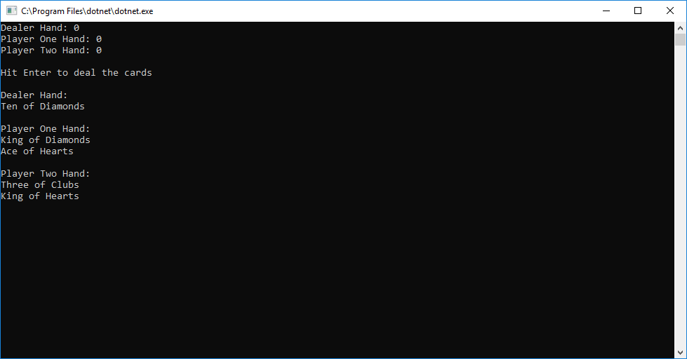

<h1> Deck of Cards </h1>

<h2> Summary </h2>

This is a project where we generate cards and decks utilizing both enum and IEnumerable to both create a deck of cards.  
I utilize the enums in my class for each card, allowing Cards creation to only be values of Ace-King and of Heart, Club, 
Diamonds, and Spades.  As is A-typical for a deck of cards.  The goal to to create things like the deck 
can be used for any card game.  Like uno for example.  All is needed is to create a new card class for uno, and 
we should still be able to utilize the class Deck.

<h5> Pre Deal </h5>

<h5> Post Deal </h5>

<h2> Setup </h2>

-Open VS community  
-Create new project  
-Go to File  
-New  
-New Project  
-In the window on the left you will see a .NET Core option under Visual C# make sure you have that selected  
-Now in the middle section select Console App (.NET Core)  
-Next in the bottom change the name to your choice and change path if you want and then click "Ok"  
-Next click view  
-Then Solution Explorer  
-If it wasnt already there it will open a tab on the right side showing your Solution Explorer  
-Next click on the tiny folder tab in the Solution explorer tab the change to Solution Explorer - Folder View  
-Navigate to Program.cs file and double click to open it  
-Once you have that open copy and paste the source code below into the Program.cs file  
-Hit control S to save the source code you pasted into your file  
-Now go back up to the Solution Explorer - Folder View and hit the little folder tab to change back to the just the Solution Explorer  
-Now its time to run the code in the top nav bar hit Debug  
-Then Click Start Debug to see the deck total before removal after removal and after adding!  